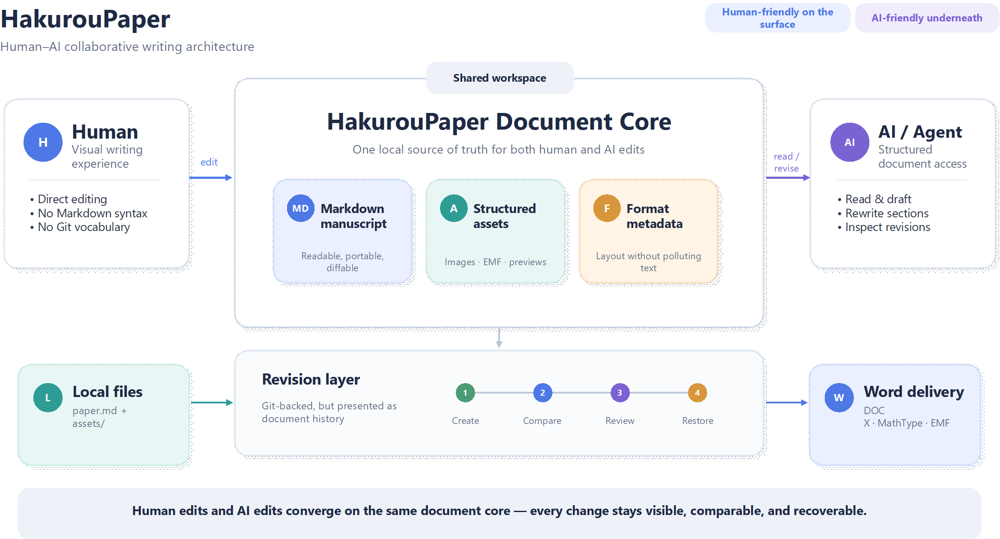

# HakurouPaper：面向人与 AI 协同写作的本地优先文稿工作区

## 摘要

随着生成式 AI 逐渐进入长文档写作流程，传统文档工具在“可直接编辑”与“可追踪修改”之间暴露出新的矛盾。HakurouPaper 试图提供一种更自然的协作方式：作者仍然在熟悉的可视化界面中编辑正文、公式、表格与图片，而底层文稿保持为清晰、开放的 Markdown，使 AI 能够直接理解文稿结构并参与起草、重写和持续修改。同时，版本历史由本地 Git 管理，并以面向文稿的方式呈现修改位置、比较结果与恢复操作。最终文稿仍可交付为 Word，从而兼顾 AI 协作、人工审阅与现实写作流程。

**关键词：** 人机协同写作；Markdown；版本管理；本地优先；学术写作

## 1. 设计目标

代码领域已经形成了成熟的人机协作方式：AI 可以直接操作结构化纯文本，开发者则通过 Diff、版本记录与回退机制检查每一次变化。文档写作仍然缺少同样自然的工作流。一方面，要求所有作者直接使用原始 Markdown 或 LaTeX 并不现实；另一方面，仅在传统文档软件旁增加一个聊天窗口，也很难解决长文稿持续修改后的审阅与追踪问题。

HakurouPaper 因此将 **“对人友好的编辑体验”** 与 **“对 AI 友好的文稿结构”** 放在同一个工作区中。作者不需要感知底层 Markdown 和 Git 的细节，但文稿本身仍然保持开放、可迁移，并能够被 AI 可靠地读取和修改。

## 2. 文稿与协作架构

将时刻 $t$ 的文稿状态记为 $D_t$。在 HakurouPaper 中，一篇文稿可以抽象为正文、资源、格式信息和版本状态的组合：

$$
D_t = \{M_t,\ A_t,\ F_t,\ V_t\},
$$

其中，$M_t$ 表示 Markdown 正文，$A_t$ 表示图片等本地资源，$F_t$ 表示独立于正文的格式信息，$V_t$ 表示当前版本状态。这样可以使“文稿内容”“显示方式”和“版本历史”彼此解耦，同时仍然作为一个完整文稿被用户感知。

**图 1. HakurouPaper 人与 AI 协同写作架构。**

如图 1 所示，人和 AI 面对的是同一份文稿核心。人通过可视化编辑器完成阅读、输入和排版；AI 则面向结构化文稿进行理解和修改。两类操作最终汇聚到同一文稿状态，并由版本层统一记录。

## 3. 修改有迹可循

当 AI 开始参与整段重写、章节重组或连续润色时，重点已经不只是“能不能生成内容”，而是 **作者能否清楚知道它改了什么**。HakurouPaper 将每一次可交付的文稿状态作为版本节点，并将相邻状态之间的变化表示为

$$
\Delta_t = \operatorname{Diff}(D_{t-1}, D_t).
$$

这些变化不会只以源码 Diff 的形式展示。正文修改仍然显示在正文中，公式继续按照公式渲染，图片和表格也保持原有的阅读形态。作者可以快速定位变化、检查修改内容，并在需要时安全恢复到历史状态。

## 4. 从写作到底层文件

HakurouPaper 尽量让不同角色只接触自己真正需要的那一层。

| 层级 | 作者看到的内容      | AI / 工具面对的内容 | 持久化形式    |
| -- | ------------ | ------------ | -------- |
| 正文 | 可视化文稿        | 结构清晰的文本      | Markdown |
| 图片 | 直接粘贴、缩放与排版   | 明确的资源引用      | 本地资源文件   |
| 版本 | 创建版本、修改预览、恢复 | 可比较的历史状态     | Git      |
| 交付 | 导出与发送        | 独立的交付流程      | Word     |

这种分层的意义在于，Markdown 负责写作与 AI 协作，Git 负责历史与安全性，Word 则继续承担现实中的最终交付。作者无需为了使用 AI 改变整个课题组的文档习惯，也无需因为最终需要 Word 而放弃开放的写作底层。

## 5. 本地、开放与轻量

HakurouPaper 采用本地优先的设计。正文和公式保留在标准 Markdown 中，图片等资源保存在文稿附近，版本历史使用标准 Git 管理。即使以后换用其他支持 Markdown 的工具，文稿仍然可以继续打开和修改。

同时，HakurouPaper 基于 Tauri 构建，希望在保持现代编辑体验的同时维持较小的安装体积和较低的硬件要求，使它更接近一个随时可以打开的写作工具，而不是另一个庞大的工作环境。

## 6. 总结

HakurouPaper 的核心目标并不是把更多功能塞进一个 Markdown 编辑器，而是让人与 AI 在各自熟悉的方式中处理同一篇文稿：**AI 面对清晰、结构化、可追踪的内容，人面对熟悉、直观、可恢复的文档。**

在这个基础上，写作、AI 修改、版本审阅与 Word 交付可以成为同一条连续工作流。
