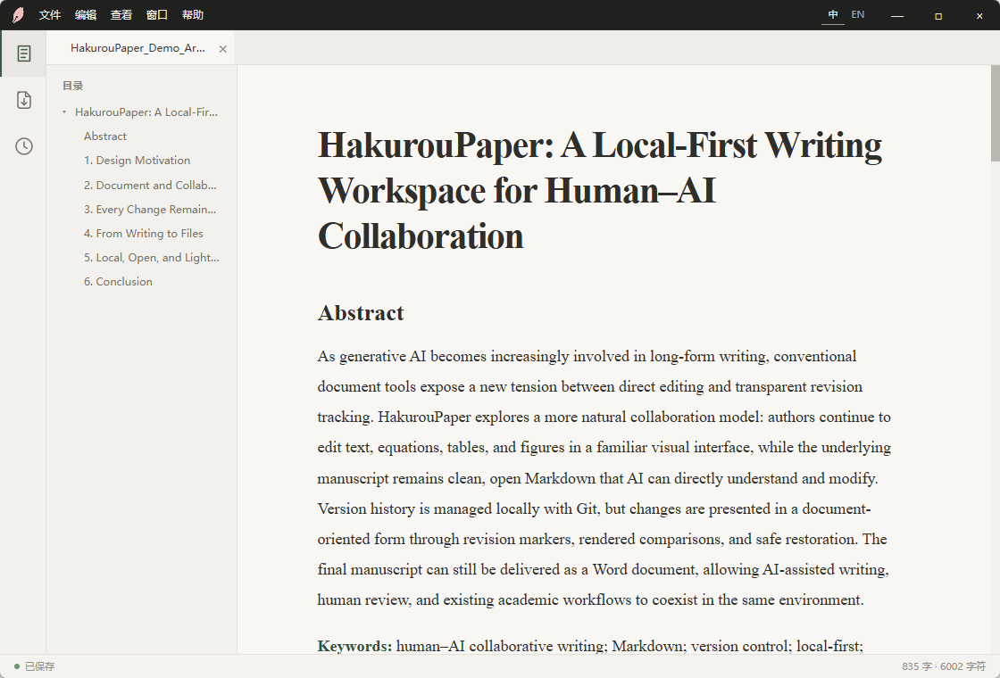
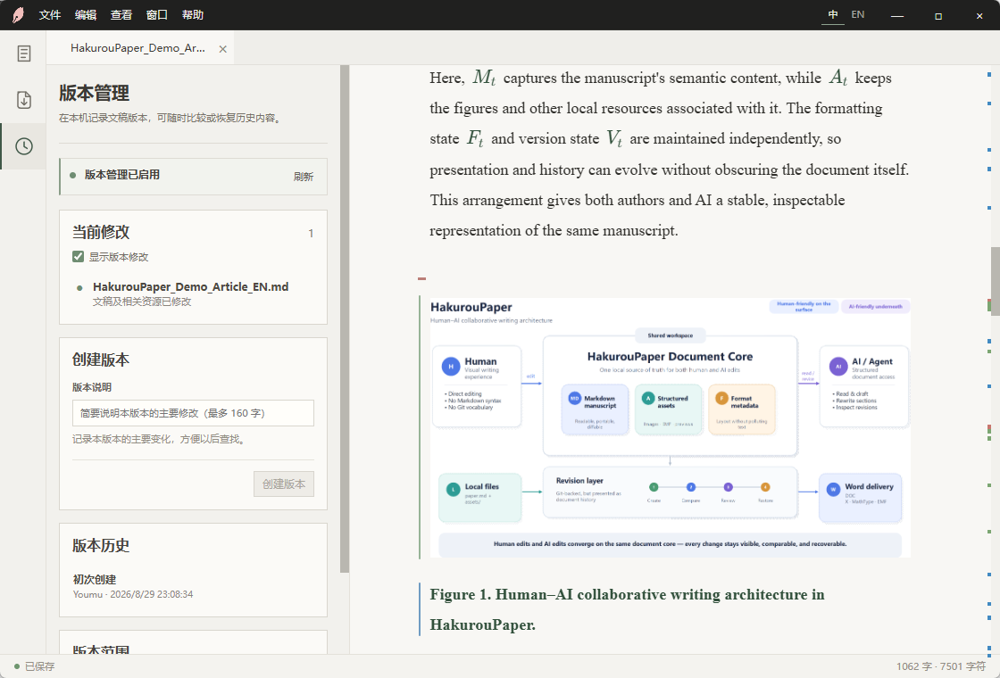
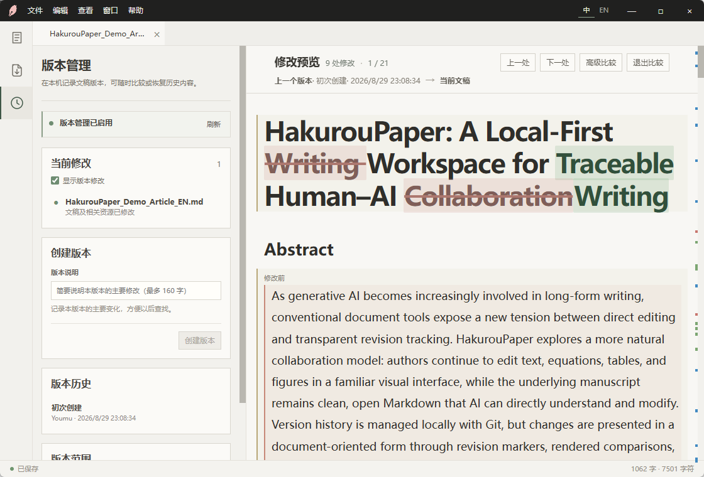
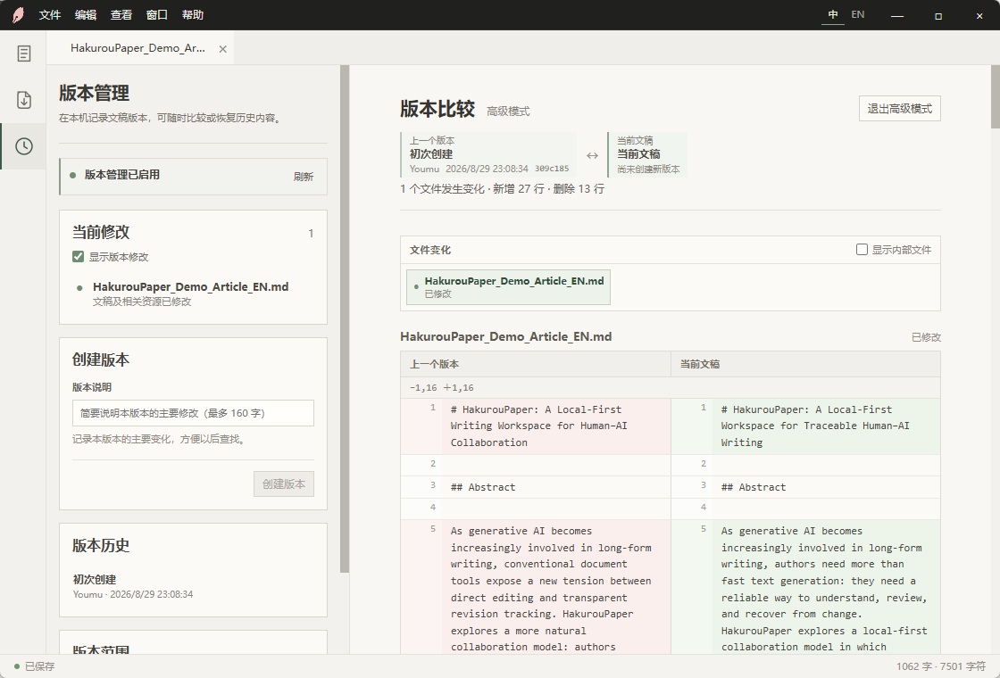
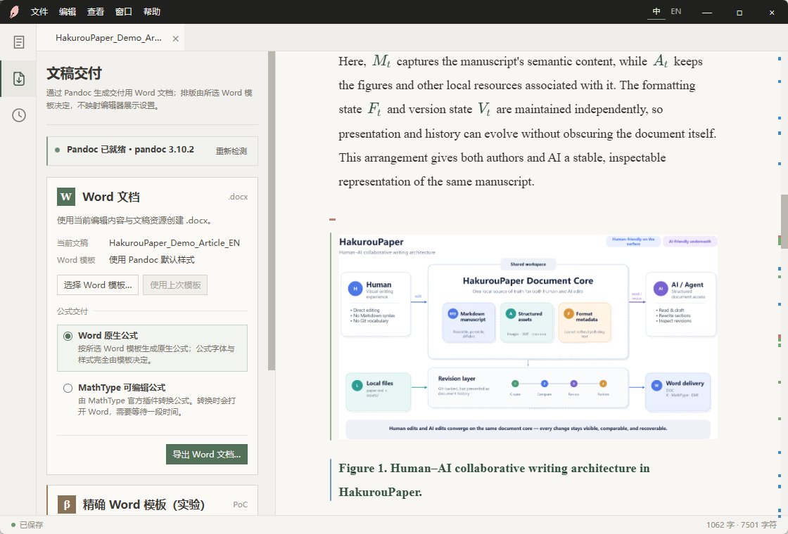

# HakurouPaper

[中文](#chinese) · [English](#english)

**让 AI 像处理代码一样理解和修改文稿，让人像编辑 Word 一样自然写作。**

HakurouPaper 是一个为 **人与 AI 共同写作** 而设计的本地优先学术写作空间。

底层是清晰、开放的 Markdown、结构化资源与 Git 版本历史；你面对的则是熟悉的可视化文档编辑体验。

无需学习 Markdown，也无需先学会 Git。自己写、让 AI 起草或修改、检查变化、恢复版本，最后再交付为 Word。

[下载 Windows 版本](https://github.com/Hakur0uken/HakurouPaper/releases/latest) · [查看全部发布版本](https://github.com/Hakur0uken/HakurouPaper/releases)

---

## 人和 AI，在同一个写作空间

AI 擅长处理结构化纯文本，程序员也早已有 Git 来查看修改、记录版本和随时撤回。

HakurouPaper 把这套能力带到普通文稿中：

* **对人**：像普通文档软件一样直接编辑；
* **对 AI**：底层始终是清晰、开放的 Markdown；
* **对协作**：每次修改都可以被查看、比较和恢复。

## 修改有迹可循

创建一个版本后继续写作，新增、修改和删除的位置会直接显示在文稿中。

查看修改时，正文仍然是正文，公式仍然是公式，图片仍然是图片。需要时，也可以进入高级模式查看精确的 Markdown Diff。

> **Give documents the same AI collaboration safety net that code already has.**

## Markdown 写作，Word 交付

Markdown 可以作为写作、AI 协作和版本管理的底层，Word 仍然作为现实中的最终交付格式。

目前支持：

* Pandoc Word 导出
* Word 原生公式 / MathType 工作流
* 表格与本地图片
* PowerPoint EMF 矢量图保留
* Word 参考模板与实验性的精确模板交付

## 本地、开放、轻量

HakurouPaper 基于 Tauri 构建，保持较小的安装体积和较低的硬件要求。

正文和公式保留在标准 Markdown 中，图片等资源保存在文稿附近，版本历史由标准 Git 管理。

即使以后换用其他支持 Markdown 的工具，你仍然可以继续打开和修改自己的文稿。

**你的文稿始终属于你。**

## 面向 AI / Agent 的未来

正式的 AI / Agent 接口仍在开发中。

长期目标不是简单增加一个聊天框，而是让 AI 可以直接理解和操作文稿结构，并在可追踪、可恢复的版本体系中与人共同完成长文档写作。

## 下载

目前提供 Windows 版本：

**[前往 Releases 下载 HakurouPaper](https://github.com/Hakur0uken/HakurouPaper/releases/latest)**

## Roadmap

* AI / Agent 文稿接口
* Remote Git / GitHub 协作
* Word 学术交付完善
* 长文档性能优化
* 跨平台支持

---

# HakurouPaper

[中文](#chinese) · [English](#english)

**Let AI understand and edit documents like code, while people write as naturally as they do in Word.**

HakurouPaper is a local-first academic writing workspace designed for **people and AI to write together**.

Underneath are clear, open Markdown, structured assets, and Git version history. What you work with is a familiar visual document-editing experience.

There is no need to learn Markdown or Git first. Write yourself, ask AI to draft or revise, inspect changes, restore versions, and deliver to Word when you are ready.

[Download for Windows](https://github.com/Hakur0uken/HakurouPaper/releases/latest) · [View all releases](https://github.com/Hakur0uken/HakurouPaper/releases)

---

## People and AI, in the same writing space

AI excels at structured plain text, and developers have long used Git to review changes, record versions, and roll back safely.

HakurouPaper brings those capabilities to everyday documents:

* **For people:** edit directly, just as in a familiar document editor;
* **For AI:** work with clear, open Markdown underneath;
* **For collaboration:** review, compare, and restore every change.

## Changes you can always trace

Keep writing after creating a version, and additions, edits, and deletions are shown directly in the document.

When reviewing changes, paragraphs remain paragraphs, equations remain equations, and images remain images. When needed, switch to Advanced mode for an exact Markdown diff.

> **Give documents the same AI collaboration safety net that code already has.**

## Write in Markdown, deliver in Word

Markdown is the foundation for writing, AI collaboration, and version management. Word remains the practical format for final delivery.

Currently supported:

* Pandoc Word export
* Native Word equation / MathType workflows
* Tables and local images
* PowerPoint EMF vector graphics preserved
* Word reference templates and experimental precise-template delivery

## Local, open, and lightweight

Built with Tauri, HakurouPaper keeps installation size small and hardware requirements modest.

Text and equations stay in standard Markdown, assets live beside the document, and version history is managed with standard Git.

Even if you later move to another Markdown-capable tool, you can continue opening and editing your work.

**Your documents always belong to you.**

## Built for future AI / Agent workflows

The formal AI / Agent interface is still in development.

The long-term goal is not simply to add a chat box, but to let AI understand and operate on document structure while people collaborate on long-form writing through a traceable, recoverable versioning system.

## Download

Windows builds are currently available:

**[Get HakurouPaper from Releases](https://github.com/Hakur0uken/HakurouPaper/releases/latest)**

## Roadmap

* AI / Agent document interface
* Remote Git / GitHub collaboration
* More complete academic Word delivery
* Long-document performance improvements
* Cross-platform support
